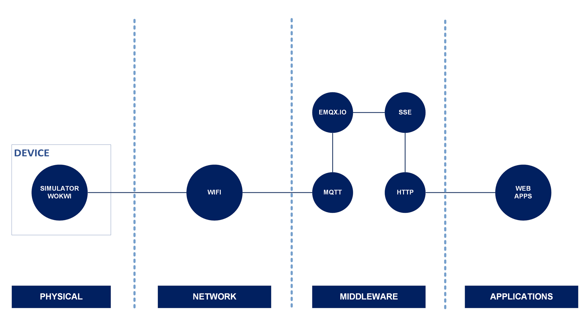

[](https://github.com/ellerbrock/open-source-badges/)
[](https://opensource.org/licenses/MIT)


# Dashboard IoT Berbasis Node.js
This project has high resource efficiency and performance, including real-time data processing, as well as good cybersecurity.

<br>

## Project Requirements

| Part | Description |
| --- | --- |
| Scheme | Virtual |
| Features | • Publish<br>• Subscribe |
| Development Board | DOIT ESP32 DEVKIT V1 |
| Code Editor | Visual Studio Code |
| Application Support | • Wokwi<br>• MQTTX<br>• Node.js |
| IoT Platform | EMQX Broker |
| Communications Protocol | • Hypertext Transfer Protocol (HTTP)<br>• Message Queuing Telemetry Transport (MQTT) |
| IoT Architecture | 3 Layer |
| Framework | • Bootstrap 5<br>• Express.js<br>• Font-Awesome 6 |
| Libraries | MQTT.js |

<br><br>

## Download & Install

1. Visual Studio Code

   <table><tr><td width="810">

   ```
   https://bit.ly/VScode_Installer
   ```

   </td></tr></table><br>

2. NodeJS

   <table><tr><td width="810">

   ```
   https://nodejs.org/en/download/prebuilt-installer
   ```

   </td></tr></table><br>

3. MQTTX

   <table><tr><td width="810">

   ```
   https://mqttx.app/downloads
   ```

   </td></tr></table><br>

4. Font-Awesome

   <table><tr><td width="810">

   ```
   https://fontawesome.com/download
   ```

   </td></tr></table>

<br><br>

## Project Designs
<table>
<tr>
<th width="840">Infrastructure</th>
</tr>
<tr>
<td></td>
</tr>
</table>

<br><br>

## Get Started

1. Download and extract this repository.<br><br>

2. Open the `Web` directory, then open `CMD` inside the directory.<br><br>

   • First, if no error occurs then just skip this step, but if otherwise then please copy the following command:

      <table><tr><td width="810">

   ```bash
   npm install
   ```

      </td></tr></table><br>

   • Secondly, to run the server with repeated refreshes automatically can be done with the command:

      <table><tr><td width="810">

   ```bash
   nodemon server.js
   ```

      </td></tr></table><br>

3. Open your `Browser`, then type -> `localhost:3000` or customize the one on your `CMD`.<br><br>

4. Fill in the Topic and Data form first, for example: `kelasiot/pot` | `4095` -> then click `Publish`, then the result will be displayed.<br><br>

5. This port and Topic Subscribe can be changed according to the user's preference. These settings are contained in a file called `server.js`.<br><br>

6. Have fun and enjoy [Done].

<br><br>

## Simulation With MQTTX

`MQTTX Web` provides 2 communication protocols, namely `WebSocket (WS)` and `WebSocket Secure (WSS)`. There is also `MQTTX Desktop`, which is a more complete option.<br><br>

1. If you are using `MQTTX Web`, make sure to select the `WSS` protocol to be secure.<br><br>

2. If you are using `MQTTX Desktop`, don't forget to download the app. Then, once downloaded, open that application on your laptop or computer.<br><br>

3. Click `+ New Connection` -> then name the connection as you want -> then click `Connect`.<br><br>

4. Create a new topic with the name `kelasiot/pot`.<br><br>

5. Then for topic settings you can customize as seen below:

   • Format Payload to Publish by : &nbsp; `Plaintext`.

   • Qos : &nbsp; `0`.

   • Put a check mark on `Retain`.<br><br>

6. Publish data.<br><br>

7. After that, please click `+ New Subscription` -> then list the topics you want to subscribe, for example: `kelasiot/#`.<br><br>

8. Wait for the subscription results to be displayed.<br><br>

9. Have fun and enjoy [Done].

<br><br>

## Simulation With Wokwi

Link to simulate : <strong><a href="https://wokwi.com/projects/413253569138415617" target="_blank">Click Here</a></strong>

<br><br>

## Highlights

<table>
<tr>
<th width="420">Dashboard View</th>
<th width="420">Running the Server</th>
</tr>
<tr>
<td></td>
<td></td>
</tr>
</table>
<table>
<tr>
<th width="420">MQTTX Simulation</th>
<th width="420">Wokwi Simulation</th>
</tr>
<tr>
<td></td>
<td></td>
</tr>
</table>

<br><br>

## Appreciation

If this work is useful to you, then support this work as a form of appreciation to the author by clicking the `⭐Star` button at the top of the repository.

<br><br>

## Disclaimer

This application is the result of the development of the Kelas IoT Workshop. I do not deny that I still use third-party services in this work, including: libraries, frameworks, and so on.

<br><br>

## LICENSE

MIT License - Copyright © 2024 - Devan C. M. Wijaya, S.Kom

Permission is hereby granted without charge to any person obtaining a copy of this software and the software-related documentation files to deal in them without restriction, including without limitation the right to use, copy, modify, merge, publish, distribute, sublicense, and/or sell copies of the Software, and to permit persons receiving the Software to be furnished therewith on the following terms:

The above copyright notice and this permission notice must accompany all copies or substantial portions of the Software.

IN ANY EVENT, THE AUTHOR OR COPYRIGHT HOLDER HEREIN RETAINS FULL OWNERSHIP RIGHTS. THE SOFTWARE IS PROVIDED AS IS, WITHOUT WARRANTY OF ANY KIND, EITHER EXPRESS OR IMPLIED, THEREFORE IF ANY DAMAGE, LOSS, OR OTHERWISE ARISES FROM THE USE OR OTHER DEALINGS IN THE SOFTWARE, THE AUTHOR OR COPYRIGHT HOLDER SHALL NOT BE LIABLE, AS THE USE OF THE SOFTWARE IS NOT COMPELLED AT ALL, SO THE RISK IS YOUR OWN.
